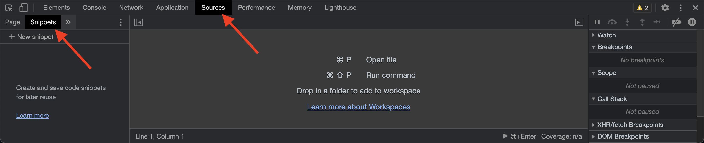
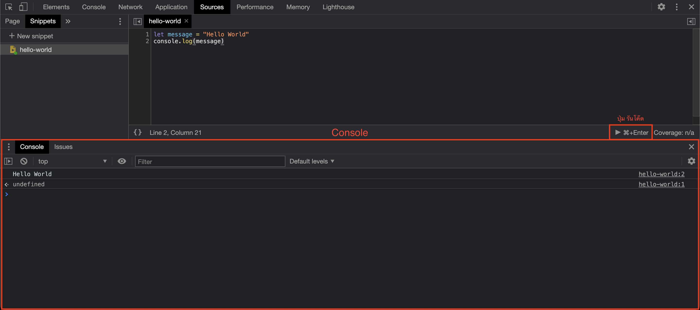

# Hello World, JavaScript

ภาษา JavaScript เป็นภาษาเขียนโปรแกรมประเภท Interpreted Programming Language เป็นที่รู้จักกันดีว่าเป็นภาษาของโลกเว็บไซต์
ในบทเรียนนี้เราจะมาเขียนโปรแกรม HelloWorld ในภาษา JavaScript กัน

## 1. JavaScript runtime

การที่รันโค๊ดภาษา JavaScript ได้นั้น เราจะต้องติดตั้งโปรแกรมที่เรียกว่า JavaScript runtime เสียก่อน ซึ่งพี่จ๊อบก็ค่อนข้างมั่นใจว่าคนที่เข้ามาอ่านบทความนี้มี JavaScript runtime ติดตั้งในเครื่องของเราเรียบร้อยแล้ว เพราะเจ้าตัว JavaScript runtime นั้นเป็นส่วนนึงของ Web Browser ที่เราใช้อยู่นั้นเอง

## 2. Text Editor

เราสามารถเขียนโค๊ด JavaScript ได้โดยไม่ต้องใช้โปรแกรมอื่นนอกจาก Web Browser เลย 
ในบทเรียนนี้ก็แนะนำให้ทุกคนใช้ Google Chrome และทำตามนี้ได้เลย

#### 1. เปิด Developer Tool

คลิกที่ไอคอน  ด้านมุมบนขวาของ 
Google Chrome แล้วเลือก `More Tools` -> `Developer Tools` (หรือกด F12 ก็ได้) จากนั้นคลิกที่แทป `Sources` และเลือกเมนู `snippet`


> ถ้าหาเมนู `snippet` ไม่เจอลองกดปุ่มลูกศรที่อยู่ข้าง ๆ

#### 2. สร้าง snippet ใหม่
คลิกที่ปุ่ม `+ New snippet` และตั้งชื่อ snippet ของเราว่า `hello-world` และเขียนโค๊ดด้านล่างลงไปตรงกลาง

```javascript
let message = "Hello World"
console.log(message)
```

#### 3. รันโค๊ด
คลิกปุ่มรันด้านล่างขวามือ (หรือกด Ctrl + Enter) เราก็จะเห็นว่ามีคำว่า Hello World ปรากฏออกมาใน Console

