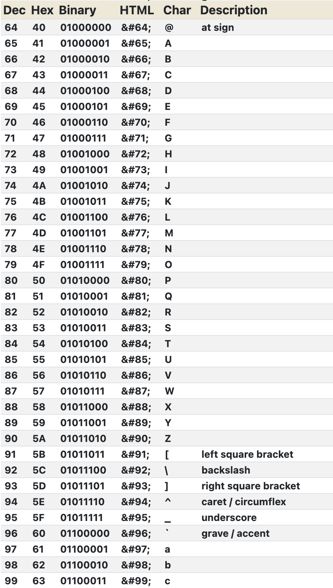
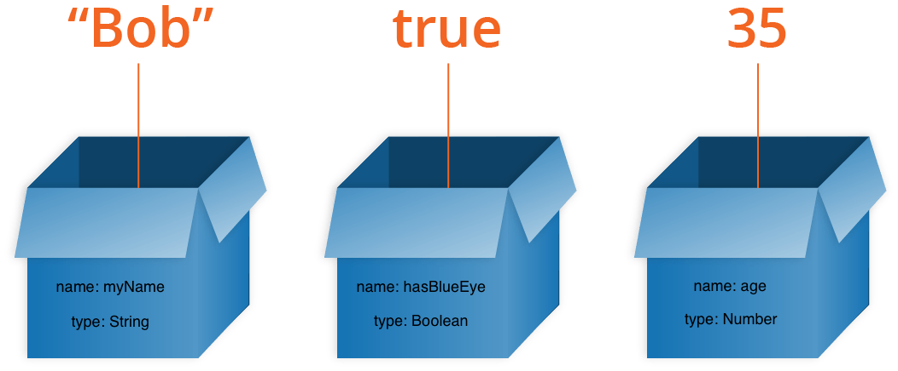

# Storing Infomation With Variable

ตอนที่หัดเขียนโปรแกรมใหม่ เราอาจมองว่าคอมพิวเตอร์คือคนความจำสั้นคนหนี่ง คน ๆ นี้ความจำเพียงพอแค่คิดเลขง่าย ๆ เช่น 

```
3 + 5
```

แต่ถ้าต้องทำการคำนวณยาว ๆ เช่น

```
1 + 2 + 3 + 4 + 5 + 6
```

มันจะไม่สามารถทำในทีเดียวได้ จำเป็นต้องทำทีละขั้นตอนคือ 

```
1 + 2 = 3
3 + 3 = 6
6 + 4 = 10
...
```

ด้วยความที่คอมพิวเตอร์นั้นความจำสั้น การจัดเก็บข้อมูลให้ดีจึงเป็นเรื่องสำคัญมากในการเขียนโปรแกรม

# Variables


เราอาจมองว่าการเก็บข้อมูลในตัวแปรเหมือนกันเก็บของลงในกล่อง ในภาษา JavaScript เราสามารถประกาศตัวแปรได้โดย

```javascript
let myName = "Bob"
```

ตัวอย่างโค๊ดด้านบนมีจุดที่สำคัญหลายอย่าง
- `let` เป็น keyword ในภาษา JavaScript ใช้ในการประกาศตัวแปรโดยเฉพาะ
- `myName` คือ "ชื่อตัวแปร"  ซี่งเป็นเหมือนกับการแปะป้ายชื่อลงบนกล่อง 
    - เวลาเราเก็บของในกล่อง (ให้นึกภาพกล่องจำนวนมากเช่นเป็น 1000+) เราคงไม่อยากให้มีกล่องสองกล่องที่มีชื่อเหมือนกันเพราะจะทำให้สับสนได้ง่าย การตั้งขื่อตัวแปรก็ห้ามใช้ชื่อซ้ำเช่นกัน
    - สังเกตุการใช้ตัวอักษรพิมพ์เล็ก - ใหญ่สลับกัน (camelCase) เนื่องจากในชื่อตัวแปรห้ามมีช่องว่าง (space bar) การเขียนแบบนี้จะทำให้อ่านง่ายกว่า `myname`
- เครื่องหมาย `=` เป็นการบอกว่าให้เก็บข้อมูลที่อยู่ด้านขาวมือของ `=` เข้าไปในตัวแปรด้านซ้าย
- `"Bob"` เป็นข้อมูลประเภทตัวอักษร (String) ที่ถูกเก็บในตัวแปร `myName`

# Data Type

นอกจากชื่อตัวแปรที่มีความสำคัญแล้ว อีกสิ่งหนึ่งที่มีความสัมพันธ์ไม่แพ้กันคือ Data Type หรือประเภทของข้อมูลนั้นเอง

เนื่องจากคอมพิวเตอร์เก็บข้อมูลในรูปแบบ binary หรือเลขฐานสอง (เลข 0 หรือ 1 เท่านั้น)  
การที่เราจะเก็บชื่อคนเช่น "BOB" ในคอมพิวเตอร์ได้ จำเป็นต้องแปลงตัวอักษรทั้งสามตัวเป็นเลข 0 และ 1 ซะก่อน

วิธีหนึ่งในการแปลงตัวอักษรเป็น binary คือการใช้ [ASCII Table](https://www.rapidtables.com/code/text/ascii-table.html)



จากตารางจะได้ว่า
- B แปลงเป็น `01000010`
- O แปลงเป็น `01001111`
- B แปลงเป็น `01000010`

ดังนั้นคำว่า "BOB" จึงกลายเป็น `010000100100111101000010`

ซี่งก็อาจจะมีปัญหาอีกอย่างหนึ่งเกิดขึ้นเนื่องจาก ถ้าเราต้องเก็บข้อมูลตัวเลข เช่น

```javascript
let myLuckyNumber = 42
let myLuckyLetter = "B"
```

ถ้าเราแปลงเลข 42 เป็นเลขฐานสองจะได้ `01000010` และ
ถ้าเราแปลงตัวอักษร B เป็นเลขฐานสองจะได้ `01000010` เหมือนกัน

แล้วคอมพิวเตอร์จะรู้ได้อย่างไรว่า `01000010` ควรจะเป็น 42 หรือ B

ถ้าเรากลับไปที่การมองว่าตัวแปรเหมือนกับเก็บของลงในกล่อง ป้ายที่เราควรจะแปะบนกล่องนั้นควรจะมีสองป้ายคือ "ชื่อ (name)" และ "ประเภทข้อมูล (type)"

```javascript
let name = "Bob"
let hasBlueEye = true
let age = 35
```



ใน JavaScript มี ประเภทข้อมูลพื้นฐาน (Primitive Data Type) ทั้งหมด 6 ประเภท
- String: ข้อมูลประเภทตัวอักษร เช่น "Hello", 'How are you?', '8'
- Number: ข้อมูลประเภทตัวเลข เช่น 13, 2.8, -3.5, 33e2
- Boolean: ข้อมูลความจริง true, false
- null
- undefined
- Symbol
